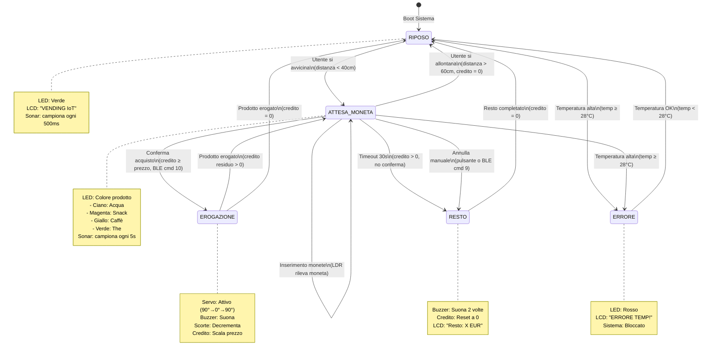
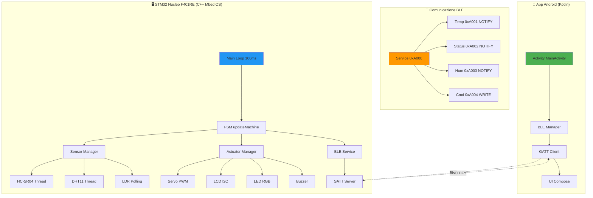
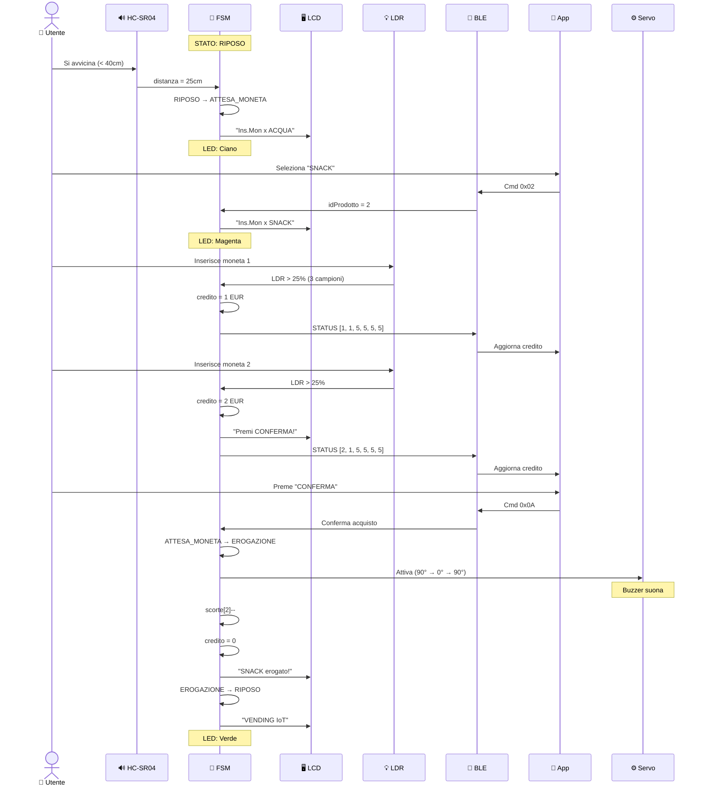
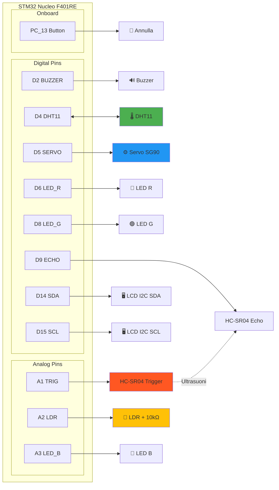
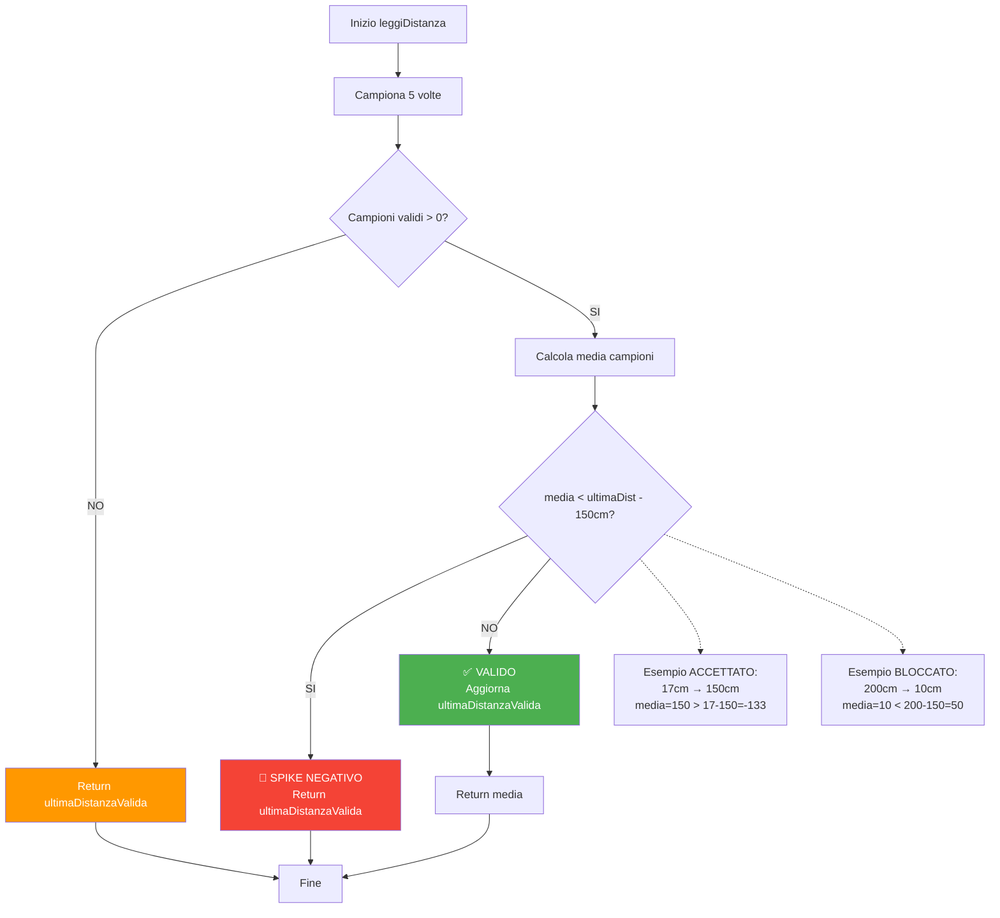
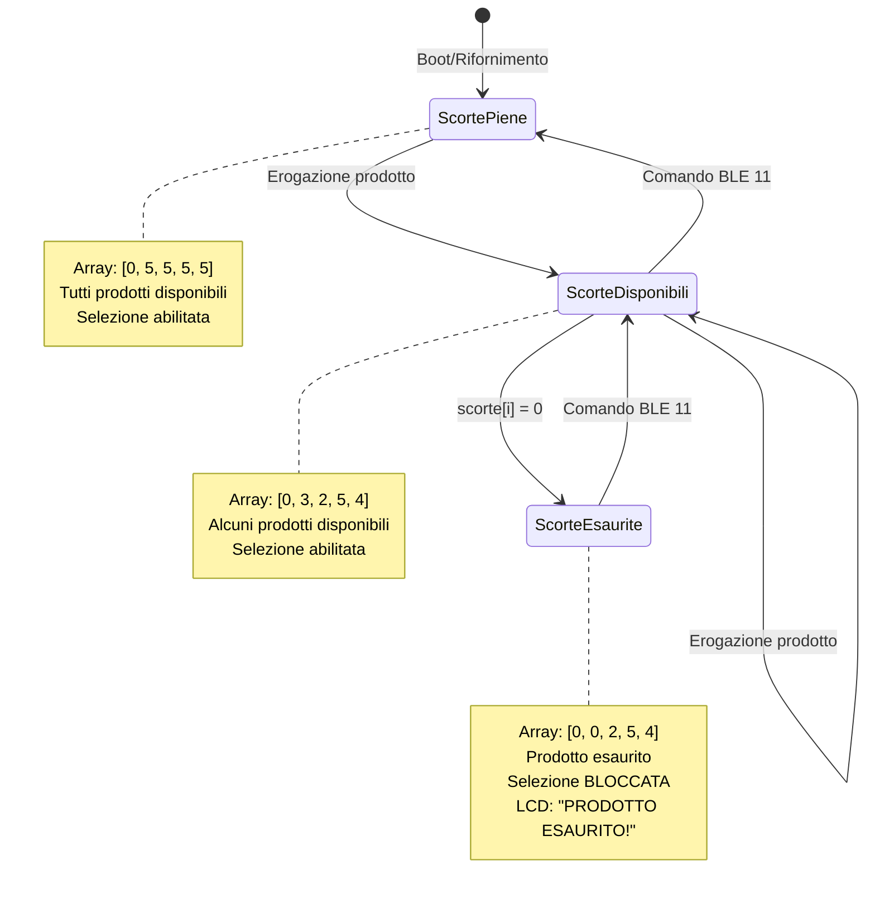
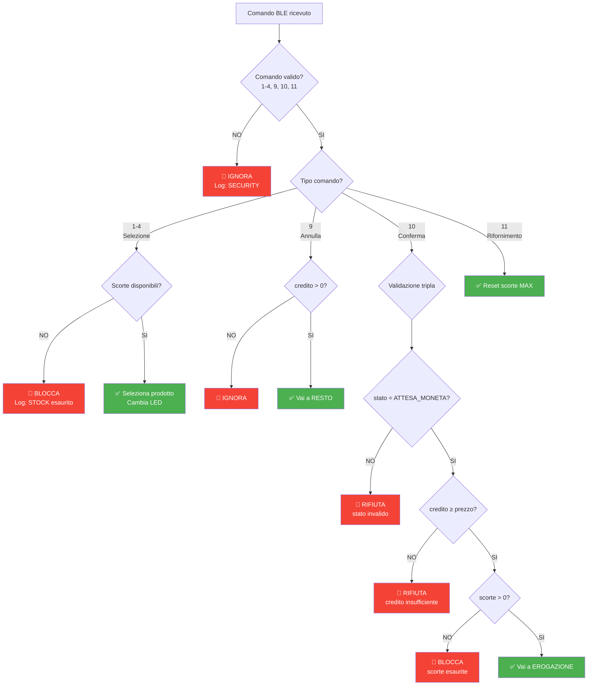

# 📐 Architettura e Diagrammi VendingMonitor v8.7 Final

Questa documentazione illustra graficamente il funzionamento del sistema VendingMonitor attraverso diagrammi esplicativi.

---

## 🔄 Diagramma FSM (Finite State Machine)

La macchina a stati finiti è il cuore del sistema. Gestisce tutti i flussi operativi del distributore.



---

## 🏗️ Architettura Sistema



---

## 📊 Flusso Operativo Utente



---

## 🔌 Architettura Hardware Pins



---

## ⚡ Timing e Performance

```mermaid
gantt
    title Ciclo Operativo Sistema (1 secondo)
    dateFormat X
    axisFormat %L ms

    section Main Loop
    Kick Watchdog           :0, 1
    Leggi LDR              :1, 5

    section Sonar (RIPOSO)
    Campiona Distanza      :10, 80
    Filtro Anti-Spike      :90, 10

    section Sonar (ATTESA_MONETA)
    Idle (ogni 5s)         :0, 100

    section DHT11 Thread
    Lettura Temp/Hum       :500, 200

    section Display
    Update LCD             :100, 20
    Log Seriale (ogni 2s)  :200, 5

    section FSM
    updateMachine (100ms)  :0, 5
    updateMachine (100ms)  :100, 5
    updateMachine (100ms)  :200, 5
    updateMachine (100ms)  :300, 5
    updateMachine (100ms)  :400, 5
    updateMachine (100ms)  :500, 5
    updateMachine (100ms)  :600, 5
    updateMachine (100ms)  :700, 5
    updateMachine (100ms)  :800, 5
    updateMachine (100ms)  :900, 5
```



---

## 🧮 Algoritmo Filtro Anti-Spike Asimmetrico



---

## 📦 Gestione Scorte



---

## 🔐 Sicurezza e Validazioni



---

## 📈 Ottimizzazioni v8.7 Final

### Sonar Campionamento Adattivo

| Stato FSM | Frequenza Campionamento | Motivazione |
|-----------|------------------------|-------------|
| **RIPOSO** | 500ms (2 Hz) | 🎯 Rileva presenza utente rapidamente |
| **ATTESA_MONETA** | 5s (0.2 Hz) | ⚡ Riduce overhead, utente già presente |
| **EROGAZIONE** | 5s (0.2 Hz) | ⚡ Non necessario durante erogazione |
| **RESTO** | 5s (0.2 Hz) | ⚡ Non necessario durante resto |

### LDR Debouncing Ottimizzato

**Prima (v8.5):**
- Campioni richiesti: 5
- Tempo minimo: 300ms
- ❌ Problema: valori oscillanti non rilevati

**Dopo (v8.7):**
- Campioni richiesti: **3** (riduzione 40%)
- Tempo minimo: **200ms** (riduzione 33%)
- ✅ Compensa oscillazioni LDR

### Log Seriale Compatto

**Prima (v8.5):**
```
╔════════════════════════════════════════════════════════════════╗
║ [STATUS] VendingMonitor v8.5 - Monitor Variabili Principali  ║
╠════════════════════════════════════════════════════════════════╣
║ STATO FSM:  ATTESA_MONETA                      ║
║ CREDITO:      2 EUR                                          ║
...
╚════════════════════════════════════════════════════════════════╝
```
**12 righe verticali**

**Dopo (v8.7):**
```
[STATUS] ATTESA_MONETA | €2 | P2@2EUR | LDR:25% | DIST:30cm | T:22°C H:48% | SCORTE: A5 S4 C5 T5
```
**1 riga orizzontale** (riduzione 92% spazio)

---

## 🎓 Conclusioni

Questo sistema dimostra:
- ✅ **FSM robusto** con gestione completa stati ed eventi
- ✅ **Comunicazione BLE** bidirezionale (comandi + notifiche)
- ✅ **Algoritmi ottimizzati** (filtro anti-spike asimmetrico, campionamento adattivo)
- ✅ **Validazioni di sicurezza** su scorte, credito, stati
- ✅ **Performance eccellenti** (loop 100ms, watchdog 10s)

**Versione:** v8.7 Final
**Autore:** Marco Santoro
**Data:** 2025-01-03
