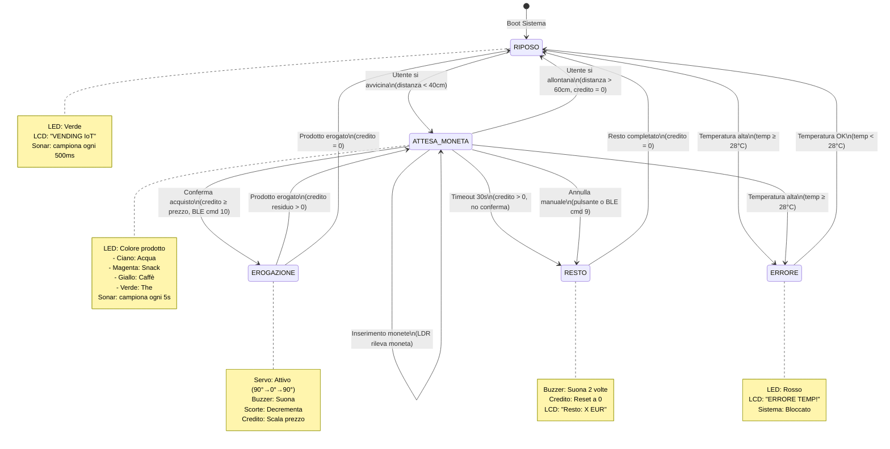
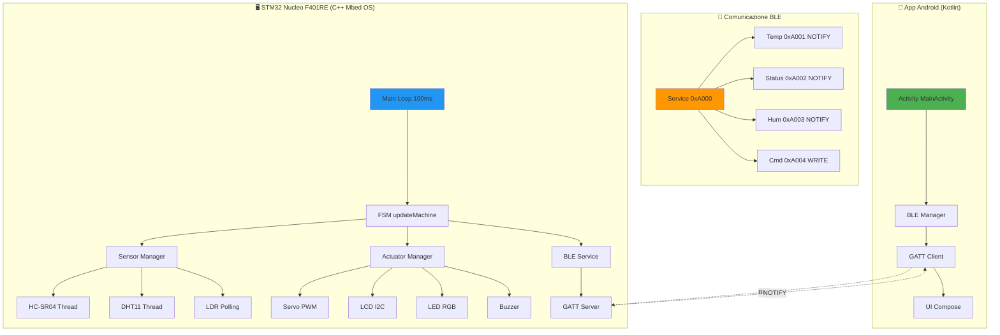
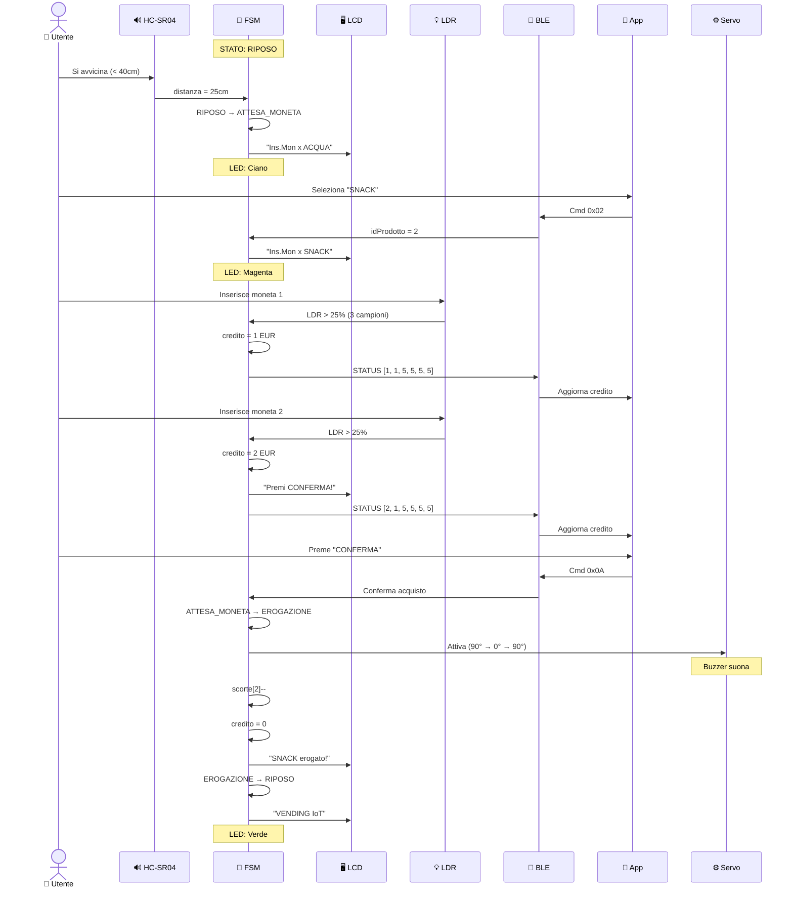
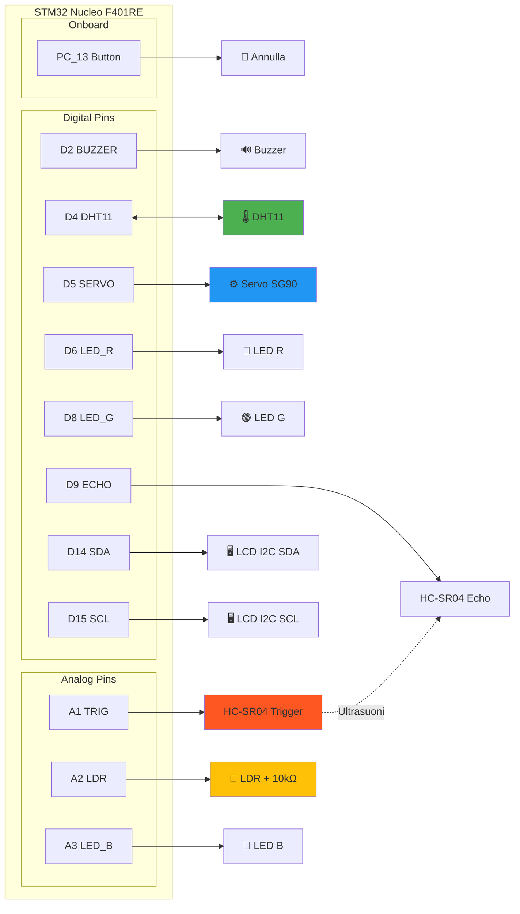
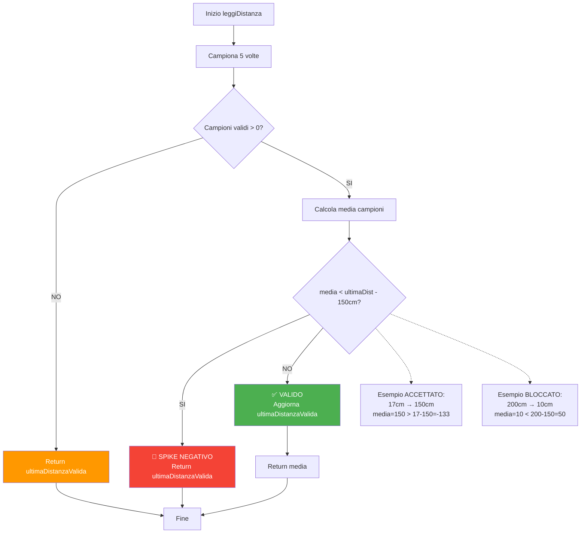
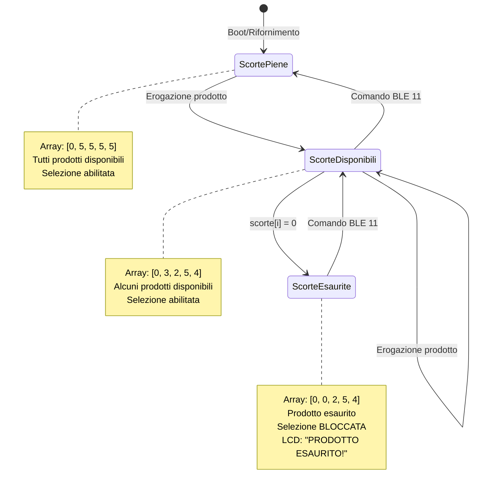
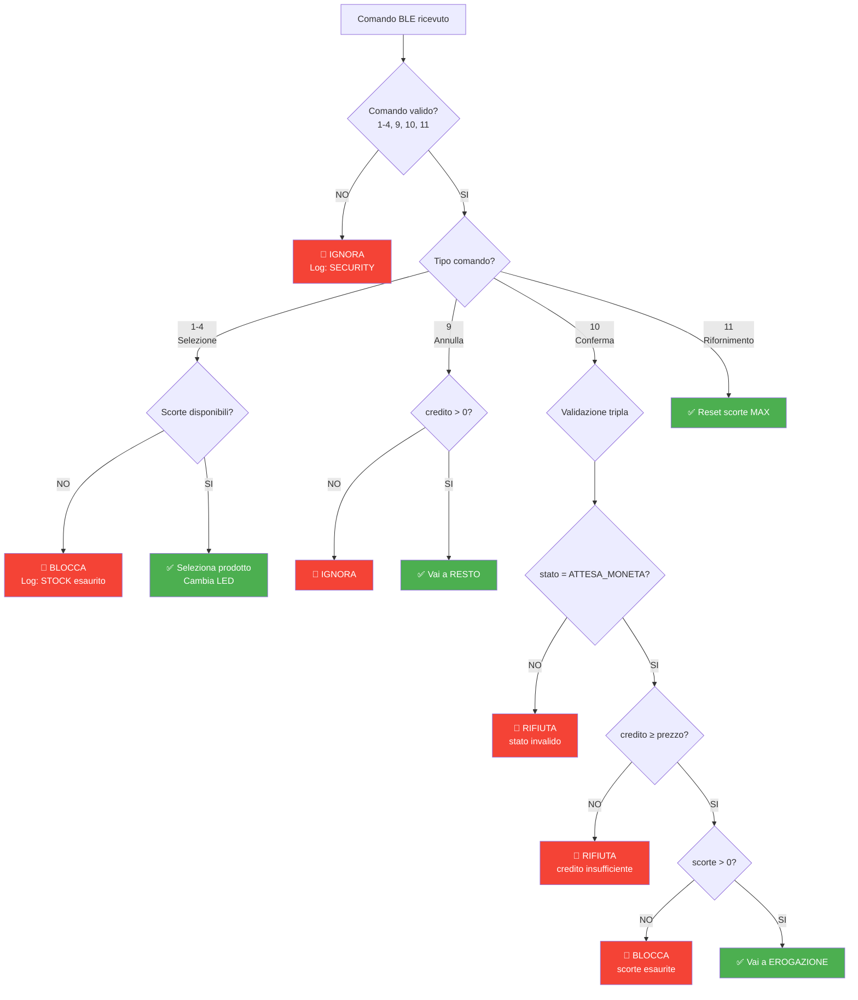

# 📐 Architettura e Diagrammi VendingMonitor v8.14

Questa documentazione illustra graficamente il funzionamento del sistema VendingMonitor attraverso diagrammi esplicativi.

**Versione Firmware**: v8.14 (LCD Refill Feedback + Sonar Stable)
**Versione App Android**: v2.0 (Font migliorato + Documentazione IT)

---

## 🔄 Diagramma FSM (Finite State Machine)

La macchina a stati finiti è il cuore del sistema. Gestisce tutti i flussi operativi del distributore.


```mermaid
stateDiagram-v2
    [*] --> RIPOSO: Boot Sistema

    RIPOSO --> ATTESA_MONETA: Utente si avvicina\n(distanza < 40cm)
    ATTESA_MONETA --> RIPOSO: Utente si allontana\n(distanza > 60cm, credito = 0)

    ATTESA_MONETA --> ATTESA_MONETA: Inserimento monete\n(LDR rileva moneta)

    ATTESA_MONETA --> RESTO: Timeout 30s\n(credito > 0, no conferma)
    ATTESA_MONETA --> RESTO: Annulla manuale\n(pulsante o BLE cmd 9)

    ATTESA_MONETA --> EROGAZIONE: Conferma acquisto\n(credito ≥ prezzo, BLE cmd 10)

    EROGAZIONE --> ATTESA_MONETA: Prodotto erogato\n(credito residuo > 0)
    EROGAZIONE --> RIPOSO: Prodotto erogato\n(credito = 0)

    RESTO --> RIPOSO: Resto completato\n(credito = 0)

    RIPOSO --> ERRORE: Temperatura alta\n(temp ≥ 28°C)
    ATTESA_MONETA --> ERRORE: Temperatura alta\n(temp ≥ 28°C)

    ERRORE --> RIPOSO: Temperatura OK\n(temp < 28°C)

    note right of RIPOSO
        LED: Verde
        LCD: "VENDING IoT"
        Sonar: campiona ogni 500ms
    end note

    note right of ATTESA_MONETA
        LED: Colore prodotto
        - Ciano: Acqua
        - Magenta: Snack
        - Giallo: Caffè
        - Verde: The
        Sonar: campiona ogni 5s
    end note

    note right of EROGAZIONE
        Servo: Attivo (90°→0°→90°)
        Buzzer: Suona
        Scorte: Decrementa
        Credito: Scala prezzo
    end note

    note right of RESTO
        Buzzer: Suona 2 volte
        Credito: Reset a 0
        LCD: "Resto: X EUR"
    end note

    note right of ERRORE
        LED: Rosso
        LCD: "ERRORE TEMP!"
        Sistema: Bloccato
    end note
```

---

## 🏗️ Architettura Sistema


```mermaid
graph TB
    subgraph "📱 App Android (Kotlin)"
        A[Activity MainActivity] --> B[BLE Manager]
        B --> C[GATT Client]
        C --> D[UI Compose]
    end

    subgraph "📡 Comunicazione BLE"
        E[Service 0xA000]
        E --> F1[Temp 0xA001 NOTIFY]
        E --> F2[Status 0xA002 NOTIFY]
        E --> F3[Hum 0xA003 NOTIFY]
        E --> F4[Cmd 0xA004 WRITE]
    end

    subgraph "🖥️ STM32 Nucleo F401RE (C++ Mbed OS)"
        G[Main Loop 100ms] --> H[FSM updateMachine]
        H --> I[Sensor Manager]
        I --> I1[HC-SR04 Thread]
        I --> I2[DHT11 Thread]
        I --> I3[LDR Polling]

        H --> J[Actuator Manager]
        J --> J1[Servo PWM]
        J --> J2[LCD I2C]
        J --> J3[LED RGB]
        J --> J4[Buzzer]

        H --> K[BLE Service]
        K --> L[GATT Server]
    end

    C -.BLE.-> L
    L -.NOTIFY.-> C

    style A fill:#4CAF50
    style G fill:#2196F3
    style E fill:#FF9800
```

---

## 📊 Flusso Operativo Utente


```mermaid
sequenceDiagram
    actor U as 👤 Utente
    participant S as 🔊 HC-SR04
    participant F as 🧠 FSM
    participant L as 🖥️ LCD
    participant LDR as 💡 LDR
    participant BLE as 📡 BLE
    participant APP as 📱 App
    participant SERVO as ⚙️ Servo

    Note over F: STATO: RIPOSO
    U->>S: Si avvicina (< 40cm)
    S->>F: distanza = 25cm
    F->>F: RIPOSO → ATTESA_MONETA
    F->>L: "Ins.Mon x ACQUA"
    Note over F: LED: Ciano

    U->>APP: Seleziona "SNACK"
    APP->>BLE: Cmd 0x02
    BLE->>F: idProdotto = 2
    F->>L: "Ins.Mon x SNACK"
    Note over F: LED: Magenta

    U->>LDR: Inserisce moneta 1
    LDR->>F: LDR > 25% (3 campioni)
    F->>F: credito = 1 EUR
    F->>BLE: STATUS [1, 1, 5, 5, 5, 5]
    BLE->>APP: Aggiorna credito

    U->>LDR: Inserisce moneta 2
    LDR->>F: LDR > 25%
    F->>F: credito = 2 EUR
    F->>L: "Premi CONFERMA!"
    F->>BLE: STATUS [2, 1, 5, 5, 5, 5]
    BLE->>APP: Aggiorna credito

    U->>APP: Preme "CONFERMA"
    APP->>BLE: Cmd 0x0A
    BLE->>F: Conferma acquisto
    F->>F: ATTESA_MONETA → EROGAZIONE
    F->>SERVO: Attiva (90° → 0° → 90°)
    Note over SERVO: Buzzer suona
    F->>F: scorte[2]--
    F->>F: credito = 0
    F->>L: "SNACK erogato!"

    F->>F: EROGAZIONE → RIPOSO
    F->>L: "VENDING IoT"
    Note over F: LED: Verde
```

---

## 🔌 Architettura Hardware Pins


```mermaid
graph LR
    subgraph "STM32 Nucleo F401RE"
        subgraph "Analog Pins"
            A1[A1 TRIG]
            A2[A2 LDR]
            A3[A3 LED_B]
        end

        subgraph "Digital Pins"
            D2[D2 BUZZER]
            D4[D4 DHT11]
            D5[D5 SERVO]
            D6[D6 LED_R]
            D8[D8 LED_G]
            D9[D9 ECHO]
            D14[D14 SDA]
            D15[D15 SCL]
        end

        subgraph "Onboard"
            PC13[PC_13 Button]
        end
    end

    A1 --> HC1[HC-SR04 Trigger]
    D9 --> HC2[HC-SR04 Echo]
    HC1 -.Ultrasuoni.-> HC2

    A2 --> LDR1[📡 LDR + 10kΩ]

    D4 <--> DHT[🌡️ DHT11]

    D5 --> SRV[⚙️ Servo SG90]

    D2 --> BUZ[🔊 Buzzer]

    D6 --> LEDR[🔴 LED R]
    D8 --> LEDG[🟢 LED G]
    A3 --> LEDB[🔵 LED B]

    D14 --> LCD1[🖥️ LCD I2C SDA]
    D15 --> LCD2[🖥️ LCD I2C SCL]

    PC13 --> BTN[🔘 Annulla]

    style HC1 fill:#FF5722
    style DHT fill:#4CAF50
    style SRV fill:#2196F3
    style LDR1 fill:#FFC107
```

---

## ⚡ Timing e Performance


```mermaid
gantt
    title Ciclo Operativo Sistema (1 secondo)
    dateFormat X
    axisFormat %L ms

    section Main Loop
    Kick Watchdog           :0, 1
    Leggi LDR              :1, 5

    section Sonar (RIPOSO)
    Campiona Distanza      :10, 80
    Filtro Anti-Spike      :90, 10

    section Sonar (ATTESA_MONETA)
    Idle (ogni 5s)         :0, 100

    section DHT11 Thread
    Lettura Temp/Hum       :500, 200

    section Display
    Update LCD             :100, 20
    Log Seriale (ogni 2s)  :200, 5

    section FSM
    updateMachine (100ms)  :0, 5
    updateMachine (100ms)  :100, 5
    updateMachine (100ms)  :200, 5
    updateMachine (100ms)  :300, 5
    updateMachine (100ms)  :400, 5
    updateMachine (100ms)  :500, 5
    updateMachine (100ms)  :600, 5
    updateMachine (100ms)  :700, 5
    updateMachine (100ms)  :800, 5
    updateMachine (100ms)  :900, 5
```

---

## ⏱️ Schemi Temporali Segnali (Timing Diagrams)

Questa sezione documenta nel dettaglio i timing dei segnali hardware e le sequenze temporali delle operazioni.

### 📡 HC-SR04 Sonar - Timing Singola Misura

```
Tempo (μs):  0      2    4    14   15         15000-15015        15030
             |      |    |    |    |              |                |
TRIG:   _____|      |____|_____________________________________________
             0      1    0

ECHO:   ____________|¯¯¯¯¯¯¯¯¯¯¯¯¯¯¯¯¯¯¯¯¯¯¯¯¯¯¯|_____________________
                    ↑                         ↑
                  echoRise()              echoFall()
                    ISR                      ISR

echoDuration: 0 ────────────→ [calcolo] ──────→ [valore finale]

Fasi:
1. [0-2μs]    TRIG = 0, wait_us(2)
2. [2-4μs]    TRIG = 1, wait_us(10) → Genera impulso 10μs
3. [4-14μs]   Impulso trigger attivo
4. [14μs]     TRIG = 0
5. [15μs-X]   Attesa ECHO (max 15ms timeout)
6. [X-Y]      ECHO alto → echoDuration = tempo alto
7. [15ms]     Timeout attesa risposta

Note:
- echoDuration viene azzerato PRIMA di ogni misura (fix v8.13)
- Timeout 15ms = ~250cm range massimo
- Validazione: 2cm ≤ distanza ≤ 400cm
```

### 🪙 LDR Coin Detection - Timing Lettura Moneta

```
Tempo (ms):  0        50       100      150      200      250
             |        |        |        |        |        |
LDR Value:
(baseline)   ────────────────────────────────────────────────
  100

(moneta      ┌───────────────┐
 inserita)   │               │
  150    ────┘               └────────────────────────────
             ↑               ↑
          Spike +50%      Reset +5%
          Detected        (moneta OK)

Stato FSM:   ATTESA_────ATTESA_────ATTESA_────EROGAZIONE────
             MONETA     MONETA     MONETA

Credito:     0€   →     0€    →    1€    →    1€

Sequenza Operazioni:
T=0ms:    Lettura LDR = 100 (baseline)
T=20ms:   Lettura LDR = 150 (+50% spike)
          → ldrSpike = true
          → ldrSpikeStart = timer.read_ms()
          → LED flash bianco 50ms

T=70ms:   Verifica spike持続 > 30ms?
          → SI: credito += 1€
          → ldrSpike = false
          → Aggiorna BLE characteristic

T=120ms:  Lettura LDR = 105 (+5% baseline)
          → baseline += (105-100) * 0.1 = baseline + 0.5
          → Nuovo baseline = 100.5 (adattamento EMA)

Parametri:
- SOGLIA_SPIKE_PERCENT: +20% (baseline adattivo)
- SOGLIA_RESET_PERCENT: +5% (anti-flickering)
- MIN_SPIKE_DURATION: 30ms (debounce moneta)
- EMA_ALPHA: 0.1 (adattamento lento baseline)
```

### 📱 BLE Command Sequence - Timing Operazioni

```
Sequenza Tipica Acquisto via App:

T=0ms          App                  STM32 (BLE)              LCD Display
               |                        |                         |
T=0          CONNECT BLE ──────────────>│                         │
               |                        │                         │
T=50           │                        ├──> BLE CONNESSO!        │
               |                        │     App collegata       │
               |                        │     [1500ms display]    │
T=100        SELECT PROD=2 ────────────>│                         │
               |                        │                         │
T=120          │                   idProdotto=2                   │
               │                   prezzoSelezionato=150          │
               │                        │                         │
T=150          │                        ├──> Ins.Mon x SNACK      │
               |                        │     [permanente]        │
T=1000     INSERT COIN ───────────────> │                         │
  (fisico)     |                   (LDR spike)                    │
T=1050         │                   credito=100                    │
               │                        │                         │
T=1100         │                        ├──> Cr:100E T:29s        │
               |                        │     [update continuo]   │
T=2000     INSERT COIN ───────────────> │                         │
T=2050         │                   credito=200                    │
               │                        │                         │
T=2100         │                        ├──> Conf. x SNACK!       │
               |                        │     [credito >= prezzo] │
T=2500     CONFIRM (cmd=10) ──────────>│                         │
               |                        │                         │
T=2520         │                   EROGAZIONE state              │
               │                        │                         │
T=2550         │                        ├──> EROGAZIONE...        │
               |                        │     Attendere           │
T=2600         │                   motore.write(1)               │
               |                   thread_sleep_for(2000)         │
T=4600         │                   motore.write(0)               │
               │                   scorte[2]--                    │
               │                        │                         │
T=4650         │                        ├──> EROGATO SNACK!       │
               |                        │     Resto: 50E          │
T=6650         │                   RESTO state                    │
               |                   eroga 50E resto                │
T=8650         │                   RIPOSO state                   │
               │                        │                         │
T=8700         │                        ├──> VENDING IoT          │
               |                        │     Pronto              │
               |                        │                         │

Comandi BLE Disponibili:
- cmd=1-4:  Selezione prodotto (1=Acqua, 2=Snack, 3=Caffè, 4=The)
- cmd=9:    Annulla + resto immediato
- cmd=10:   Conferma acquisto (se credito >= prezzo)
- cmd=11:   Rifornimento scorte (reset a SCORTE_MAX=5)

Timing BLE:
- Latenza comando: ~20ms (ricezione → esecuzione)
- Update characteristic: ~10ms (STM32 → App notifica)
- Reconnect time: ~500ms (dopo disconnessione)
```

### 🖥️ LCD Display - Timing Operazioni Scrittura

```
Sequenza Scrittura Standard:

Tempo (ms):  0      20     25     520    525
             |      |      |      |      |
Operazione:  clear  wait   setCursor   printf  wait
             |      |      |      |      |
             └──────┴──────┴──────┴──────┘

lcd.clear():          [0ms]    Comando clear
wait_us(20000):       [20ms]   Attesa stabilizzazione LCD
lcd.setCursor(0,0):   [25ms]   Posiziona riga 0
lcd.printf("txt"):    [25ms]   Scrive testo riga 0
wait_us(500):         [25.5ms] Micro-pausa inter-riga
lcd.setCursor(0,1):   [26ms]   Posiziona riga 1
lcd.printf("txt"):    [26ms]   Scrive testo riga 1

Esempio: Feedback Rifornimento (v8.14)

T=0ms:    lcd.clear()
T=20ms:   wait_us(20000) ────────────────────┐
T=40ms:   setCursor(0,0)                     │ Fase 1
T=41ms:   printf("RIFORNIMENTO... ")         │ [800ms tot]
T=41ms:   wait_us(500)                       │
T=42ms:   setCursor(0,1)                     │
T=42ms:   printf("Attendere       ")   ──────┘

T=840ms:  thread_sleep_for(800) ──> Display visibile 800ms

T=840ms:  lcd.clear()
T=860ms:  wait_us(20000) ────────────────────┐
T=880ms:  setCursor(0,0)                     │ Fase 2
T=881ms:  printf("RIFORNIMENTO OK!")         │ [2000ms tot]
T=881ms:  wait_us(500)                       │
T=882ms:  setCursor(0,1)                     │
T=882ms:  printf("Scorte: 5/5/5/5 ")   ──────┘

T=2880ms: thread_sleep_for(2000) ──> Display visibile 2s

T=2880ms: lcd.clear()
T=2900ms: wait_us(20000)
T=2920ms: [ritorno a display normale]

Timing Critici:
- wait_us(20000) dopo clear: OBBLIGATORIO (corruzione display)
- wait_us(500) tra righe: RACCOMANDATO (stabilità I2C)
- thread_sleep_for(): Permette task switch RTOS
```

### 🎰 Product Dispensing - Sequenza Erogazione

```
Sequenza Completa Erogazione Prodotto:

Fase       Tempo    Operazione                 LCD Display              Hardware
────────────────────────────────────────────────────────────────────────────────
CONFERMA   T=0ms    Verifica credito          "Conf. x SNACK!"         LED colore
                    credito >= prezzo                                   prodotto

           T=50ms   BLE cmd=10 ricevuto       [mantiene conferma]      -

DISPENSE   T=100ms  Entra EROGAZIONE state    "EROGAZIONE..."          -
                                               "Attendere"

           T=150ms  Verifica scorte[id] > 0   [mantiene messaggio]     -

           T=200ms  motore[id].write(1)       [mantiene messaggio]     Motore ON

           T=200-   ███████████████████       [erogazione visibile]    Motore
           T=2200ms [thread_sleep_for(2000)]                           running

           T=2200ms motore[id].write(0)       [switch immediato]       Motore OFF

           T=2220ms scorte[id]--              "EROGATO SNACK!"         -
                    credito -= prezzo          "Resto: 50E"

           T=2240ms Aggiorna BLE status       [mantiene erogato]       -

RESTO      T=4220ms thread_sleep_for(2000)   [messaggio visibile 2s]  -
                    completa

           T=4220ms Entra RESTO state         "RESTO..."               LED giallo
                                               "Eroga: 50E"             lampeggio

           T=4270ms Calcola monete resto      [mantiene resto]         -
                    monete[50E, 20E, 10E...]

           T=4300ms Eroga monete ciclo        [conta monete]           Motore resto
                    for(ogni moneta)                                   ON/OFF

           T=6300ms Fine resto                "TRANSAZIONE OK!"        -
                    credito = 0                "Grazie!"

RIPOSO     T=8300ms thread_sleep_for(2000)   [messaggio visibile]     -

           T=8300ms Torna RIPOSO state       "VENDING IoT"            LED verde
                                              "Pronto"

Timing Critici:
- Motore ON: 2000ms (tempo erogazione meccanica)
- Display "EROGATO": 2000ms (feedback utente)
- Display "RESTO": variabile (dipende monete)
- Display "GRAZIE": 2000ms (cortesia finale)

Gestione Errori:
- Se scorte[id] = 0: Salta erogazione, resto immediato
- Se temp >= 28°C: Blocca erogazione, entra ERRORE state
- Se BLE disconnect durante: Auto-refund immediato (v8.11)
```

### 🔄 DHT11 Temperature - Thread Separato

```
DHT11 Thread (lettura ogni 2 secondi):

Thread Main                  Thread DHT11              DHT11 Sensor
  |                              |                          |
  ├─── main() start              |                          |
  │                              |                          |
  ├─── thread_dht.start() ──────>│                          |
  │                              │                          |
  │                              ├── while(1) loop          |
  │                              │                          |
T=0s                             ├── dht.read() ───────────>│
  │                              │   [wait response]        │
  │                              │                          ├─ Sensor reading
  │                              │                          │  [200ms typical]
  │                              │<─────────────────────────┘
  │                              │   temp = xx°C
  │                              │   hum = yy%
  │                              │
  │                              ├── Verifica soglie
  │                              │   temp >= 28°C?
  │                              │
  │<──────── flag ERRORE ────────┤   SI: statoCorrente=ERRORE
  │         (se temp alta)       │
  │                              │
  │                              ├── thread_sleep_for(2000)
T=2s                             │
  │                              ├── dht.read() ───────────>│
  │                              │                          │

Timing:
- Intervallo letture: 2000ms (2 secondi)
- Tempo lettura DHT11: ~200ms (protocollo 1-wire)
- Soglia temperatura: 28°C (ERRORE state)
- Thread priority: Normal (RTOS scheduling)

Sincronizzazione:
- Accesso atomico a 'statoCorrente' (enum read/write)
- Nessun mutex richiesto (single writer, multiple readers)
- Display temp aggiornato nel main loop ogni 2s
```

---

## 🧮 Algoritmo Filtro Anti-Spike Asimmetrico


```mermaid
flowchart TD
    A[Inizio leggiDistanza] --> B[Campiona 5 volte]
    B --> C{Campioni validi > 0?}

    C -->|NO| D[Return ultimaDistanzaValida]
    C -->|SI| E[Calcola media campioni]

    E --> F{media < ultimaDist - 150cm?}

    F -->|SI| G[🚫 SPIKE NEGATIVO<br/>Return ultimaDistanzaValida]
    F -->|NO| H[✅ VALIDO<br/>Aggiorna ultimaDistanzaValida]

    H --> I[Return media]

    G --> J[Fine]
    D --> J
    I --> J

    style G fill:#f44336,color:#fff
    style H fill:#4CAF50,color:#fff
    style D fill:#FF9800,color:#fff

    note1[Esempio ACCETTATO:<br/>17cm → 150cm<br/>media=150 > 17-150=-133]
    note2[Esempio BLOCCATO:<br/>200cm → 10cm<br/>media=10 < 200-150=50]

    F -.-> note1
    F -.-> note2
```

---

## 📦 Gestione Scorte


```mermaid
stateDiagram-v2
    [*] --> ScortePiene: Boot/Rifornimento

    ScortePiene --> ScorteDisponibili: Erogazione prodotto
    ScorteDisponibili --> ScortePiene: Comando BLE 11
    ScorteDisponibili --> ScorteDisponibili: Erogazione prodotto
    ScorteDisponibili --> ScorteEsaurite: scorte[i] = 0

    ScorteEsaurite --> ScorteDisponibili: Comando BLE 11

    note right of ScortePiene
        Array: [0, 5, 5, 5, 5]
        Tutti prodotti disponibili
        Selezione abilitata
    end note

    note right of ScorteDisponibili
        Array: [0, 3, 2, 5, 4]
        Alcuni prodotti disponibili
        Selezione abilitata
    end note

    note right of ScorteEsaurite
        Array: [0, 0, 2, 5, 4]
        Prodotto esaurito
        Selezione BLOCCATA
        LCD: "PRODOTTO ESAURITO!"
    end note
```

---

## 🔐 Sicurezza e Validazioni


```mermaid
flowchart TD
    A[Comando BLE ricevuto] --> B{Comando valido?<br/>1-4, 9, 10, 11}

    B -->|NO| C[🚫 IGNORA<br/>Log: SECURITY]
    B -->|SI| D{Tipo comando?}

    D -->|1-4<br/>Selezione| E{Scorte disponibili?}
    D -->|9<br/>Annulla| F{credito > 0?}
    D -->|10<br/>Conferma| G{Validazione tripla}
    D -->|11<br/>Rifornimento| H[✅ Reset scorte MAX]

    E -->|NO| I[🚫 BLOCCA<br/>Log: STOCK esaurito]
    E -->|SI| J[✅ Seleziona prodotto<br/>Cambia LED]

    F -->|NO| K[🚫 IGNORA]
    F -->|SI| L[✅ Vai a RESTO]

    G --> G1{stato = ATTESA_MONETA?}
    G1 -->|NO| M[🚫 RIFIUTA<br/>stato invalido]
    G1 -->|SI| G2{credito ≥ prezzo?}
    G2 -->|NO| N[🚫 RIFIUTA<br/>credito insufficiente]
    G2 -->|SI| G3{"scorte > 0?"}
    G3 -->|NO| O[🚫 BLOCCA<br/>scorte esaurite]
    G3 -->|SI| P[✅ Vai a EROGAZIONE]

    style C fill:#f44336,color:#fff
    style I fill:#f44336,color:#fff
    style K fill:#f44336,color:#fff
    style M fill:#f44336,color:#fff
    style N fill:#f44336,color:#fff
    style O fill:#f44336,color:#fff

    style J fill:#4CAF50,color:#fff
    style L fill:#4CAF50,color:#fff
    style P fill:#4CAF50,color:#fff
    style H fill:#4CAF50,color:#fff
```

---

## 📈 Ottimizzazioni v8.14 (Versione Finale)

### LDR Spike Detection Adattivo (v8.9)

| Parametro | Prima (v8.8) | Dopo (v8.9) | Beneficio |
|-----------|--------------|-------------|-----------|
| **Baseline** | Fisso | EMA dinamico | ✅ Adatta a luce ambiente |
| **Soglia** | Assoluta 25% | Relativa +20% | ✅ Funziona con qualsiasi luce |
| **Reset** | 15% fisso | +5% baseline | ✅ Anti-flickering |

**Algoritmo EMA (Exponential Moving Average):**
```cpp
ldrBaseline = ((100 - α) * ldrBaseline + α * ldr_val) / 100
// α = 10 (aggressività aggiornamento)
```

### Sonar HC-SR04 Stabilizzato (v8.13-v8.14)

| Fix | Problema | Soluzione | Impatto |
|-----|----------|-----------|---------|
| **echoDuration reset** | Valori obsoleti | `echoDuration = 0` prima di ogni misura | ✅ Letture affidabili |
| **Timing ottimale** | Timeout ISR | Trig 10μs, timeout 15ms, no pause | ✅ Nessun timeout |
| **Posizionamento** | "6cm fissi" | Sensore lontano da tavolo | ✅ Range 15-150cm |

### LCD Feedback Completo (v8.10-v8.14)

| Evento | Messaggio LCD | Durata | Versione |
|--------|---------------|--------|----------|
| **BLE Connect** | "BLE CONNESSO! / App collegata" | 1.5s | v8.10 |
| **BLE Disconnect** | "BLE DISCONNESSO / App scollegata" | 1.5s | v8.10 |
| **Prodotto Confirm** | "Conf. x ACQUA!" (nome prodotto) | - | v8.10 |
| **Rifornimento** | "RIFORNIMENTO... → OK! / Scorte: 5/5/5/5" | 2.8s | v8.14 |

### Log Seriale Compatto (v8.7)

**Prima (v8.5):**
```
╔════════════════════════════════════════════════════════════════╗
║ [STATUS] VendingMonitor v8.5 - Monitor Variabili Principali  ║
╠════════════════════════════════════════════════════════════════╣
║ STATO FSM:  ATTESA_MONETA                      ║
║ CREDITO:      2 EUR                                          ║
...
╚════════════════════════════════════════════════════════════════╝
```
**12 righe verticali**

**Dopo (v8.14):**
```
[STATUS] BLE:ON | ATTESA_MONETA | €2 | P1@1EUR | LDR:47%(B:45 Δ:+2) | DIST:35cm | T:22°C H:48% | A5 S4 C5 T5
```
**1 riga orizzontale** con info baseline LDR (riduzione 92% spazio)

---

## 🎓 Conclusioni

Questo sistema dimostra:
- ✅ **FSM robusto** con gestione completa stati ed eventi
- ✅ **Comunicazione BLE** bidirezionale (comandi + notifiche)
- ✅ **Algoritmi adattivi** (LDR spike detection EMA, sonar stabile)
- ✅ **UX eccellente** (LCD feedback completo, auto-refund, indicatori scorte)
- ✅ **Validazioni di sicurezza** su scorte, credito, stati
- ✅ **Performance ottimali** (loop 100ms, watchdog 10s, log compatto)

**Versione Firmware:** v8.14 (LCD Refill Feedback + Sonar Stable)
**Versione App:** v2.0 (Font migliorato + Documentazione IT)
**Autore:** Marco Santoro
**Data:** 2026-01-06
